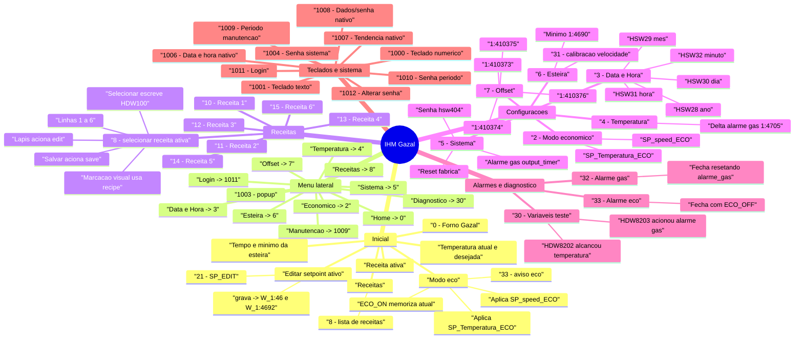
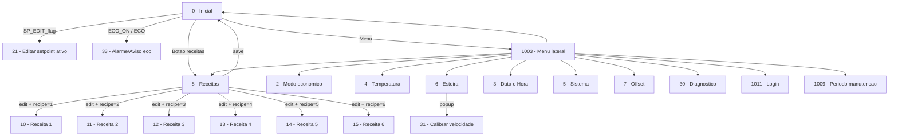

# Mapa de fluxos da IHM Gazal

Este documento foi gerado a partir de `LCD Gazal.ump`, `PlcAddrInfo.xml` e dos arquivos `screens/*.hsc`.

## Mapa mental

## Fluxo principal

## Tela de receitas

Fluxo esperado:

1. Operador entra por `0 -> 8` ou pelo menu lateral.
2. Operador seleciona uma das seis linhas.
3. A area clicavel da selecao fica no lado esquerdo da linha.
4. O lapis fica separado no lado direito e aciona `edit`.
5. O botao salvar aciona `save`.
6. O script global copia a receita selecionada para a receita ativa:
   - `nomeN -> nome_tela_0`
   - `spN -> W_1:46`
   - `tempoN -> W_1:4692`
   - `SP_REC_MEM = W_1:46`
   - `VEL_REC_MEM = W_1:4692`
   - `turnon = True`
   - `liga_desliga = True`

Pontos de validacao:

- A tela `8` usa `WordShow` com `WordAddr="recipe"` para mostrar qual linha esta marcada.
- As linhas clicaveis escrevem `HDW100` com constantes `1, 2, 4, 8, 16, 32`.
- Os lapis usam `edit` e ficam vinculados aos bits `HDX100.0` ate `HDX100.5`.
- Essa relacao `HDW100 -> recipe` ja existia na base antes do redesign. No XML e nos scripts eu nao encontrei copia explicita de `HDW100` para `recipe`, entao este e um ponto que precisa ser validado no compilador/painel real.
- O script global ainda tem caminhos para receitas `7..10`, mas a UI atual so mostra `1..6`. Se `recipe` chegar a `7..10` por memoria antiga ou escrita externa, o `edit` tenta navegar para telas antigas `16..19`. O fluxo normal da UI atual nao seleciona esses valores.

## Fluxos de configuracao

| Tela | Arquivo | Entrada principal | Acao principal |
| --- | --- | --- | --- |
| `2` | `2.hsc` | Menu lateral | Edita temperatura e tempo do modo economico |
| `4` | `4.hsc` | Menu lateral | Edita delta de temperatura do alarme de gas em `1:4705` |
| `6` | `6.hsc` | Menu lateral | Edita minimo da esteira `1:4690` e abre calibracao `31` |
| `31` | `3.hsc` | Popup pela tela `6` | Ajusta `1:451` |
| `5` | `5.hsc` | Menu lateral com senha | Reset de fabrica e liga/desliga `output_timer` |
| `3` | `17.hsc` | Menu lateral com nivel | Ajuste de data/hora em `HSW28..HSW32` |
| `7` | `16.hsc` | Menu lateral com nivel | Ajustes de offset `1:410373..1:410376` |
| `30` | `8.hsc` | Menu lateral com nivel | Diagnostico de flags `HDW8202` e `HDW8203` |

## Fluxos de operacao

### Inicializacao

O `InitialAction` global configura o controlador, defaults de ECO, alarme, modo automatico, ventilacao/esteira e seleciona `recipe = 1` quando `recipe = 0`.

### Liga/desliga e esteira

- `turnon` liga modo automatico e configura saida de alarme.
- `liga_desliga` liga `b_1:449.0` e `B_1:4550.0`.
- Ao desligar `liga_desliga`, o script volta para standby e desliga `B_1:4550.0`.
- O `BackGroundScript` para a saida de velocidade quando `W_1:41 <= des` e `liga_desliga = 0`.

### Modo economico

- Ao acionar `ECO_ON` ou `Eco_command`, o sistema memoriza `W_1:46` e `W_1:4692`.
- Depois aplica `SP_Temperatura_ECO` e `SP_speed_ECO`.
- Ao acionar `ECO_OFF` ou soltar `Eco_command`, restaura os valores memorizados.
- O popup `33` fecha acionando `ECO_OFF`.

### Editar setpoint ativo

- A home abre `21` por `SP_EDIT_flag`.
- A tela `21` grava `SP_Temperatura_ativo` em `W_1:46` e `SP_speed_ativo` em `W_1:4692`.
- Se os valores forem diferentes da receita memorizada, o nome ativo e limpo com `nome_vazio`.

### Alarme de gas

- O trigger global `output_timer` calcula a diferenca entre `W_1:46` e `W_1:4705`.
- Se `W_1:41` cair abaixo do limite calculado, liga `alarme_gas`, seta `HDW8203 = 1`, limpa `HDW8202` e altera parametros do controlador.
- Quando a temperatura volta ao normal, limpa o bloqueio, seta `HDW8202 = 1` e limpa `HDW8203`.
- Ponto de validacao: encontrei o bit `alarme_gas` e a tela `32`, mas nao encontrei `DirShow` ou `FunctionSwitch` chamando explicitamente a tela `32`. Pode depender de comportamento nativo do projeto, mas precisa ser validado no painel/compilador real.

## Telas registradas

| ScreenNo | Arquivo | Nome | Tipo |
| --- | --- | --- | --- |
| `0` | `0.hsc` | inicial | tela |
| `2` | `2.hsc` | config_modo_eco | tela |
| `3` | `17.hsc` | config_data | tela |
| `4` | `4.hsc` | config_temperatura | tela |
| `5` | `5.hsc` | config_reset | tela |
| `6` | `6.hsc` | config_esteira | tela |
| `7` | `16.hsc` | config_adjust | tela |
| `8` | `7.hsc` | pagina_receita_1-6 | tela |
| `10..15` | `10.hsc..15.hsc` | receita1..receita6 | telas de edicao |
| `20` | `20.hsc` | senha | tela antiga/auxiliar |
| `21` | `21.hsc` | SP_EDIT | child/popup |
| `30` | `8.hsc` | var_test | tela |
| `31` | `3.hsc` | calibracao_velocidade | child/popup |
| `32` | `22.hsc` | alarme_gas | child/popup |
| `33` | `23.hsc` | alarme_eco | child/popup |
| `1000` | `1000.hsc` | BuilNum | teclado numerico |
| `1001` | `1001.hsc` | BuilKey | teclado texto |
| `1002` | `1002.hsc` | Common Window | sistema |
| `1003` | `1003.hsc` | Menu lateral | popup |
| `1004` | `1004.hsc` | UserPwdKb | teclado senha |
| `1006` | `1006.hsc` | UserTimeKb | sistema |
| `1007` | `1007.hsc` | UserTrdKb | sistema |
| `1008` | `1008.hsc` | UserDataPwdKb | sistema |
| `1009` | `1009.hsc` | Installpaymentset | manutencao |
| `1010` | `1010.hsc` | InstallpaymentPwd | manutencao |
| `1011` | `1011.hsc` | UserLogin | usuario |
| `1012` | `1012.hsc` | UserChangePSW | usuario |

## Checks estruturais executados

- Todos os XML de `LCD Gazal.ump` e `screens/*.hsc` carregaram sem erro.
- Existem 32 telas registradas no `ScreenSet`.
- Todos os arquivos registrados no `ScreenSet` existem.
- Nao ha arquivo `.hsc` extra fora do `ScreenSet`.
- Todos os alvos de `FunctionSwitch`, `DirShow` e `KbdScreen` positivo apontam para telas registradas.
- Nao ha referencia de navegacao para `1.hsc`.
- Todos os `BmpIndex` usados nas telas existem em `G_Picture/G_Picture.xml`.

## Risco para compilacao

Nao da para garantir 100% sem abrir e compilar no software oficial da IHM. Pelo que foi possivel validar localmente, a branch esta estruturalmente consistente: XML valido, telas registradas, alvos existentes e imagens presentes.

Os pontos que ainda precisam de validacao no compilador/painel real sao funcionais, nao estruturais:

1. A ligacao real entre o radio `HDW100` e a variavel `recipe`.
2. A abertura real da tela `32 - alarme_gas` quando `alarme_gas = TRUE`.
3. O comportamento se `recipe` estiver salvo como `7..10`, porque a UI atual so cobre `1..6`.
